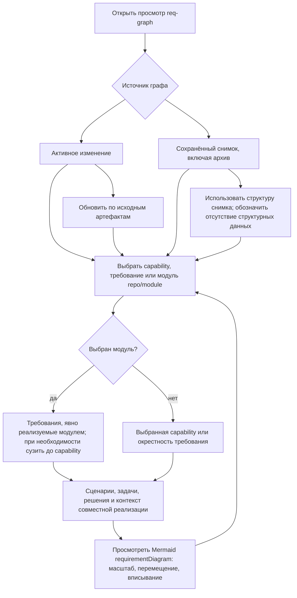

# Просмотр req-graph

Сценарий по intent.md; размещение элементов интерфейса и способы получения графа выбираются в журнале.

```mermaid
flowchart TD
    start["Открыть просмотр req-graph"] --> source{"Источник графа"}
    source --> active["Активное изменение"]
    source --> saved["Сохранённый снимок, включая архив"]
    active --> choose["Выбрать capability, требование или модуль repo/module"]
    saved --> choose
    choose --> module{"Выбран модуль?"}
    module -->|да| implemented["Требования, явно реализуемые модулем; при необходимости сузить до capability"]
    module -->|нет| selected["Выбранная capability или окрестность требования"]
    implemented --> context["Сценарии, задачи, решения и контекст совместной реализации"]
    selected --> context
    context --> diagram["Просмотреть Mermaid requirementDiagram: масштаб, перемещение, вписывание"]
    diagram --> choose
    active --> refresh["Обновить по исходным артефактам"]
    refresh --> choose
    saved --> historical["Использовать структуру снимка; обозначить отсутствие структурных данных"]
    historical --> choose
```
